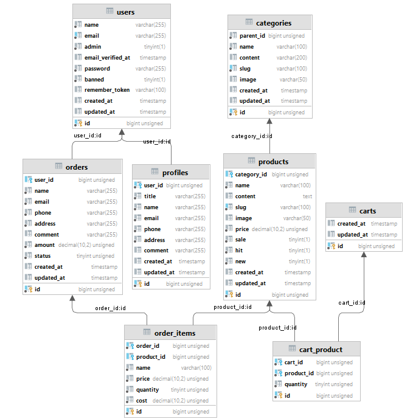
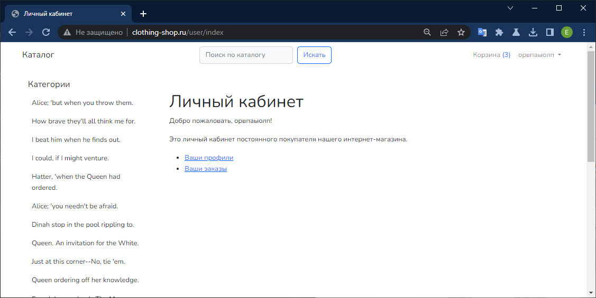
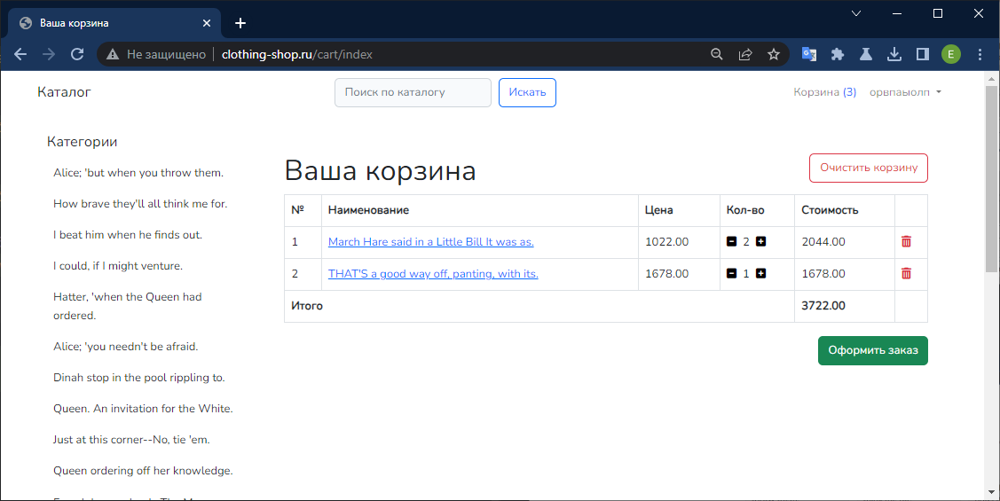
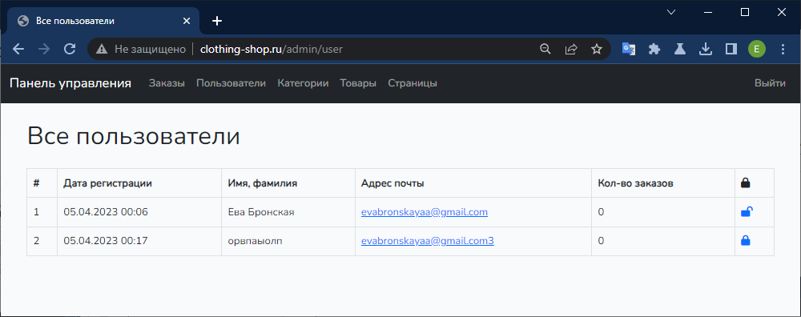

# E-shop 

## Требования

### Общие
1. Использование фреймворка (Yii2, Symphony, Laravel или другого по выбору)
2. Использование composer
3. Регистрация и авторизация
4. Публичная часть и админка
5. ACL - разграничение прав доступа

### Дополнительно
1. Оформление заказов
2. Просмотр истории заказов
3. Поиск по каталогу товаров
4. Желательно - как корзина, куда можно добавлять товары перед их заказом
5. Личный кабинет для покупателя и продавца со списком заказов в разных статусах (Новый, Оплачен, Собирается, Передан на доставку, Выполнен)
6. Публичная часть и админка (бан пользователей)

## Технические решения
* Использование composer
* PHP 8.1
* Laravel 10.4.1
* Bootstrap
* MySQL 8.0

## Схема БД




## Внешний вид

### Каталог


### Личный кабинет


### Корзина


### Админ-панель (блокирование пользователей)


## Запуск
```bash
composer install
npm install && npm run dev
```

## Запуск наполнителей БД
```bash
php artisan db:seed
```
